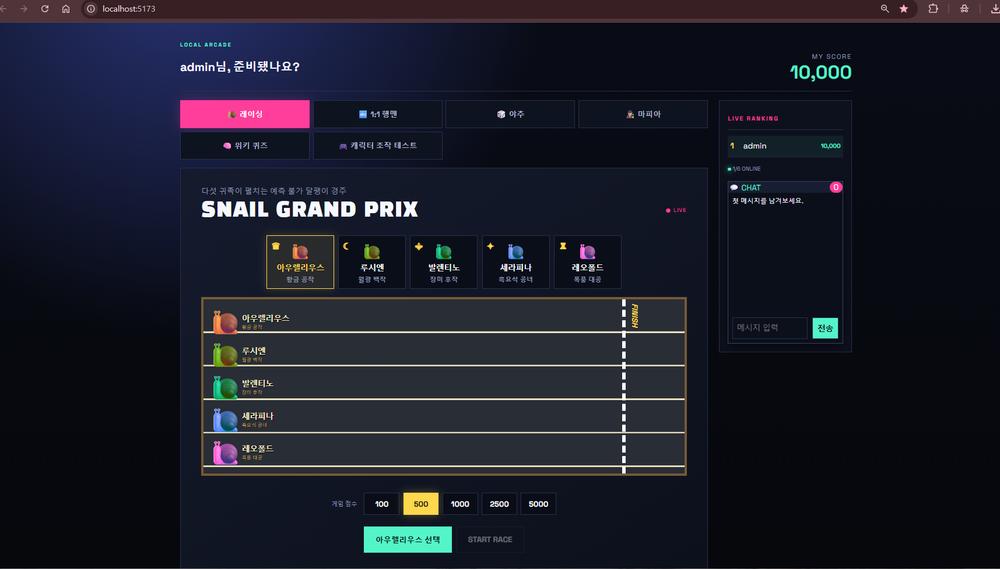
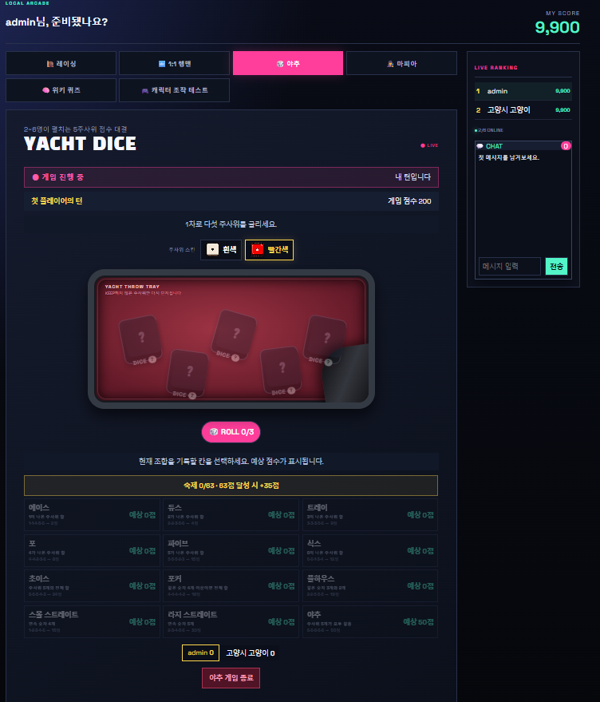

# Local Arcade

> 하나의 웹 애플리케이션 안에서 **실시간 멀티플레이, 게임 규칙 엔진, 생성형 AI, 2D 인터랙션, 운영 도구**를 함께 구현한 LAN 기반 로컬 아케이드

Local Arcade는 같은 네트워크에 있는 최대 6명이 참여 코드로 접속해 여러 게임과 학습형 콘텐츠를 즐기는 개인 프로젝트입니다. 단순히 게임 종류를 늘리는 것보다, 여러 사용자가 동시에 행동할 때에도 **서버가 하나의 일관된 결과를 판단하고 모든 화면이 같은 상태를 공유하는 구조**를 만드는 데 집중했습니다.

- 개발 형태: 개인 프로젝트 · 기획/설계/개발/테스트 100%
- 핵심 키워드: Server-authoritative · Multiplayer State · Game Logic · Generative AI · Interactive UI
- 결과물: 5종 게임/콘텐츠 · 공용 및 역할별 채팅 · 통합 크레딧 · 관리자 대시보드
- 실행 환경: 동일 LAN, 최대 6명
- 포트폴리오: [Local Arcade 포트폴리오 PDF 보기](https://drive.google.com/file/d/1959HBu6Or4D62EfnpNkB3xhXY0n8wt6p/view?usp=drive_link)



## 이 프로젝트에서 중요하게 생각한 것

### 1. 화면이 아닌 서버가 게임의 결과를 결정한다

주사위 결과, 점수 계산, 턴 전환, 레이싱 순위, 역할 배정, 투표 결과와 크레딧 정산을 서버에서 처리했습니다. 클라이언트가 전달한 값도 현재 서버 상태와 다시 비교해 잘못된 요청이나 화면 조작이 게임 결과로 이어지지 않도록 했습니다.

### 2. 작은 서비스에 맞는 동시성 전략을 선택한다

이 프로젝트의 목표 규모는 동일 LAN 내 최대 6명입니다. 모든 상태 변경 요청을 bounded single-thread 명령 큐로 직렬화하고, 서비스 단위 동기화와 DB 트랜잭션을 함께 적용했습니다. 복잡한 분산 시스템을 도입하기보다 예상 사용량에서 **중복 참가, 이중 차감, 상태 경합을 예측 가능한 순서로 처리하는 것**을 우선했습니다.

### 3. 생성형 AI의 결과를 그대로 신뢰하지 않는다

LLM 퀴즈는 직접 정리한 개발 위키 발췌문만 근거로 생성합니다. JSON Schema로 응답 구조를 제한하고, 출처·선택지 수·정답 범위를 서버에서 재검증합니다. 최근 문제와의 중복을 피하고, AI 생성을 중단해도 저장된 검증 문제로 서비스를 이어갈 수 있도록 구성했습니다.

### 4. 서로 다른 문제를 한 프로젝트에서 경험한다

턴제 게임의 규칙 엔진, 마피아의 상태 전이와 정보 은닉, 레이싱 애니메이션, 물리 기반 캐릭터 조작, AI 콘텐츠 파이프라인, 관리자 기능을 하나의 서비스로 연결했습니다. 이를 통해 CRUD 중심 구현을 넘어 **백엔드 정합성부터 사용자 피드백과 운영 관점까지** 폭넓게 다뤘습니다.

## 포트폴리오에서 보여주는 역량

| 영역 | 구현 내용 | 중요하게 본 기준 |
|---|---|---|
| 멀티플레이 | 참여 코드, Bearer 세션, 1초 폴링, 공용 상태 공유 | 모든 사용자에게 동일한 결과 전달 |
| 게임 백엔드 | 야추, 레이싱, 행맨, 마피아 규칙과 정산 | 서버 중심 검증과 예외 흐름 처리 |
| 생성형 AI | 위키 기반 문제 생성, Structured Outputs, 저장 문제 fallback | 근거성, 형식 안정성, 비용과 연속성 |
| 인터랙티브 UI | 주사위/레이싱 연출, 2D 이동·점프·충돌, 반응형 화면 | 입력과 상태에 즉각적인 시각 피드백 |
| 데이터/운영 | JPA 영속화, 트랜잭션, 크레딧, 관리자 대시보드 | 데이터 일관성과 운영 가능성 |
| 품질 검증 | JUnit 규칙 테스트, 6인 동시 요청 테스트 | 목표 규모에 맞는 재현 가능한 검증 |

## 주요 기능

### 야추 — 턴제 규칙과 서버 검증

2명 이상이 같은 참가 점수를 걸고 플레이합니다. 준비 상태, 턴 전환, 주사위 고정, 12개 점수 항목, 상단 보너스와 공동 우승을 구현했습니다. 점수 등록 시 클라이언트의 주사위와 서버의 주사위를 대조하며, 기권·중도 종료·재경기·환불까지 정상 흐름 밖의 상황도 처리합니다.



### 마피아 — 상태 전이와 사용자별 정보 제어

4~6명이 참여하며 마피아·의사·시민 역할을 서버에서 배정합니다. 밤 행동, 의사의 보호, 낮 토론, 투표와 탈락, 진영별 승리 조건을 단계별 상태로 관리합니다. 같은 게임 상태에서도 사용자의 역할과 게임 단계에 따라 공개 정보와 채팅 범위를 다르게 구성했습니다.


### 달팽이 레이싱 — 동일 결과와 시각적 연출의 분리

플레이어가 달팽이를 선택하고 크레딧을 걸면 서버가 한 번만 순위를 결정하고 모든 참가자에게 같은 결과를 제공합니다. 프론트엔드는 카운트다운, 주행, 시상대 애니메이션을 담당합니다. 고유 경기 ID를 기준으로 결과를 구분해 폴링 중 중복 재생을 방지했습니다.


### 행맨 대전 — 단어 게임과 공격 규칙의 결합

두 사용자가 참가 점수를 걸고 영문 글자를 선택합니다. 정답 글자를 맞히면 상대에게 피해를 주는 대전 규칙을 결합했으며, 중복 입력과 형식 오류를 서버에서 검증하고 승리 시 크레딧을 정산합니다.


### LLM 위키 퀴즈 — 개인 학습 기록을 콘텐츠로 전환

직접 작성한 Markdown 학습 위키에서 문서를 선택하고 OpenAI Responses API로 개념, 코드 결과, 디버깅, 시나리오, O/X 문제를 생성합니다.

- 위키 원문 발췌만 출제 근거로 제공
- JSON Schema 기반 Structured Outputs 적용
- 출처, 선택지 개수, 정답 인덱스 서버 검증
- 사용자별 최근 20문제 비교 및 중복 억제
- 생성 문제 DB 저장 및 AI 비활성화 시 재사용
- 정답 제출 후에만 해설과 출처 공개, 보상 1회 지급


### 2D 캐릭터 조작 — 시간 기반 인터랙션

방향키 이동, Shift 달리기, 점프와 발판 착지를 구현했습니다. `requestAnimationFrame`의 프레임 간 시간 차이로 이동량을 계산해 기기 성능에 따른 속도 차이를 줄였고, 중력·수직 속도·충돌 판정과 idle/walk/run/jump 스프라이트 전환을 연결했습니다.


### 공통 기능과 운영 도구

- 최근 80개 메시지를 유지하는 공용 채팅과 마피아 단계별 채팅
- 모든 콘텐츠가 공유하는 게임용 크레딧과 실시간 랭킹
- 30초 이상 비활성 사용자의 세션 및 게임 상태 정리
- 관리자 코드 인증 후 사용자 조회, 크레딧 조정, 강제 퇴장
- LLM 신규 문제 생성 활성화와 저장 문제 수 확인

크레딧은 결제·충전·출금·환전이 불가능한 게임 점수입니다.

## 시스템 구조

```text
React + TypeScript
  ├─ 사용자 입력 / 게임 화면 / 애니메이션
  └─ 상태 API 주기적 조회
                 │ REST + Bearer Token
                 ▼
Spring Boot API ── GameCommandQueue (상태 변경 직렬화)
  ├─ GameService        : 세션, 레이싱, 행맨, 크레딧
  ├─ SocialGameService  : 공용 채팅, 야추
  ├─ MafiaGameService   : 역할, 단계 전이, 투표, 전용 채팅
  └─ QuizGameService    : 위키 발췌 → OpenAI → 검증 → 저장
                 │
                 ├─ MySQL / JPA : 플레이어, 크레딧, 퀴즈
                 └─ LLM Wiki    : Markdown 학습 자료
```

상태 조회는 읽기 요청이고, 참가·투표·점수 등록·정산처럼 결과를 바꾸는 명령은 큐를 통과합니다. 프론트엔드는 서버 상태를 렌더링하되 애니메이션과 입력 경험에 집중합니다.

## 기술 스택

| 구분 | 기술 |
|---|---|
| Frontend | React 18.3, TypeScript 5.7, Vite 6, HTML5, CSS3, Fetch API |
| Backend | Java 21, Spring Boot 3.4, Spring Web MVC, Spring Data JPA, Validation |
| Database | MySQL 8, JPA/Hibernate |
| AI | OpenAI Responses API, Structured Outputs(JSON Schema), Markdown Wiki |
| Test | JUnit 5, Mockito, Python 동시 요청 테스트 |
| Build/Tools | Maven Wrapper, npm, Git/GitHub |

## 검증

### 자동화 테스트

- 야추의 Full House와 Yacht 점수 계산 단위 테스트
- 마피아의 역할 배정 이후 밤 행동, 낮 채팅, 투표 및 응답 직렬화 테스트
- 프론트엔드 TypeScript 검사와 프로덕션 빌드

```powershell
cd backend
.\mvnw.cmd test

cd ..\frontend
npm.cmd run build
```

### 최대 6명 동시 요청 테스트

프로젝트 목표 규모에 맞춰 6명 동시 입장, 야추 참가, 동일 사용자의 중복 참가, 반복 상태 조회를 자동 검증합니다.

```powershell
python scripts\local_arcade_concurrency_test.py --join-code 123456
```

최근 측정에서는 총 60건의 반복 상태 조회가 모두 성공했으며 평균 30.37ms, p95 79.85ms를 기록했습니다. 측정 환경에 따라 값은 달라질 수 있으며, 이는 대규모 부하 성능이 아닌 **LAN 6인 요구사항의 기능·동시성 검증**입니다.

## 로컬 실행

### 1. 요구 사항

- Java 21
- Node.js 및 npm
- MySQL 8 이상
- Python 3 (동시 요청 테스트 실행 시)

### 2. 환경 변수

프로젝트 루트에 `.env` 파일을 만들고 실행 환경에 맞게 설정합니다. AI 신규 출제를 사용하지 않을 경우 `OPENAI_API_KEY`는 비워 둘 수 있지만, DB에 저장된 문제가 있어야 퀴즈를 제공할 수 있습니다.

```properties
DB_URL=jdbc:mysql://localhost:3306/local_arcade?createDatabaseIfNotExist=true&serverTimezone=Asia/Seoul&characterEncoding=UTF-8
DB_USERNAME=root
DB_PASSWORD=your_password
OPENAI_API_KEY=your_api_key
OPENAI_MODEL=your_responses_api_model
QUIZ_WIKI_ROOT=../LlmWiki_Backup/wiki
```

### 3. 서버 실행

```powershell
cd backend
.\mvnw.cmd spring-boot:run
```

서버 콘솔에 6자리 참여 코드와 관리자 코드가 출력됩니다. 기본 API 포트는 `8081`입니다.

### 4. 클라이언트 실행

```powershell
cd frontend
npm.cmd install
npm.cmd run dev
```

실행 PC에서는 `http://localhost:5173`, 같은 네트워크의 다른 기기에서는 `http://실행PC의-IP:5173`으로 접속합니다.

## 프로젝트 구조

```text
gamePro/
├─ frontend/             # React UI, 게임 화면, 애니메이션
├─ backend/              # Spring Boot API, 게임 규칙, 영속화
├─ LlmWiki_Backup/wiki/  # 퀴즈의 근거가 되는 개발 학습 문서
├─ scripts/              # 6인 동시 요청 검증 스크립트
├─ Game/                 # 주요 실행 화면
└─ presentation/         # 프로젝트 발표 자료
```

## 회고와 확장 방향

이 프로젝트를 통해 멀티플레이에서 중요한 것은 화려한 화면보다 **공유 상태의 소유권과 변경 순서를 명확히 하는 것**임을 배웠습니다. 또한 LLM 기능은 호출 자체보다 근거 제한, 출력 검증, 중복 방지와 장애 시 대체 흐름을 함께 설계해야 실제 서비스 기능이 된다는 점을 경험했습니다.

현재 구조는 한 서버 프로세스와 소규모 LAN 사용을 전제로 하므로 인메모리 게임 상태와 폴링을 사용합니다. 공개 서비스로 확장한다면 WebSocket 기반 이벤트 전송, Redis를 이용한 공유 상태와 분산 락, 통합 테스트 확대, 세션 만료 정책과 관리자 인증 강화를 다음 과제로 고려할 수 있습니다.

## 관련 자료

- [Local Arcade 포트폴리오 PDF](https://drive.google.com/file/d/1959HBu6Or4D62EfnpNkB3xhXY0n8wt6p/view?usp=drive_link)
- [Frontend](./frontend)
- [Backend](./backend)
- [LLM 학습 위키](./LlmWiki_Backup/wiki)
- [발표 대본](./presentation/발표대본.md)
